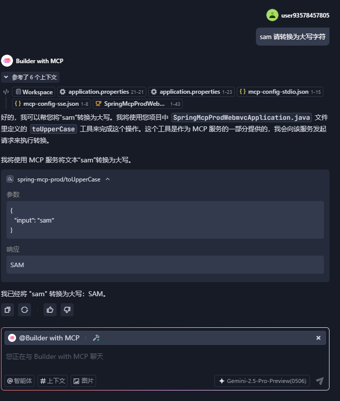

# spring mcp prod webmvc

### stdio模式

```
{
  "mcpServers": {
    "spring-mcp-prod": {
      "command": "java",
      "args": [
        "-Dspring.ai.mcp.server.stdio=true",
        "-Dspring.main.web-application-type=none",
        "-Dlogging.pattern.console=",
        "-jar",
        "D:/workspace-micronaut-kotlin/spring-mcp-prod-webmvc/build/libs/spring-mcp-prod-webmvc-1.0.0.jar"
      ]
    }
  }
}
```


### SSE模式
```
{
  "mcpServers": {
    "spring-mcp-prod": {
      "url": "http://localhost:8080/sse"
    }
  }
}
```
